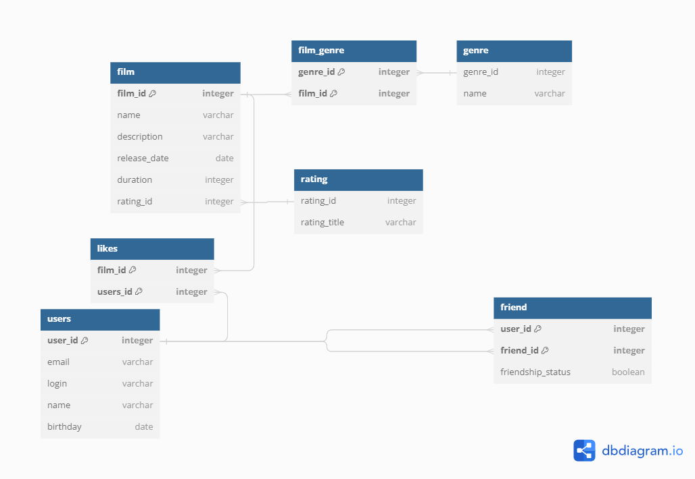

# java-filmorate
Template repository for Filmorate project.

--получение лайков фильма
SELECT f.name,
COUNT(l.users_id)
FROM films AS f
RIGHT OUTER JOIN like AS l ON f.id = l.id

-- получение 10 популярных фильмов
SELECT f.name
FROM films AS f
WHERE f.id IN (SELECT id
FROM like
GROUP BY id
ORDER BY COUNT(users_id DESC)
LIMIT 10)

--получение всех пользователей
SELECT user_id,
login,
name
FROM users

--получение общих друзей
SELECT users_id,
login,
name
FROM users AS u
RIGHT OUTER JOIN friends AS f ON u.users_id = f.users_id
WHERE f.friend_id IN
(SELECT friend_id
FROM friends
GROUP BY users_id
WHERE users_id = 'id второго пользователя')